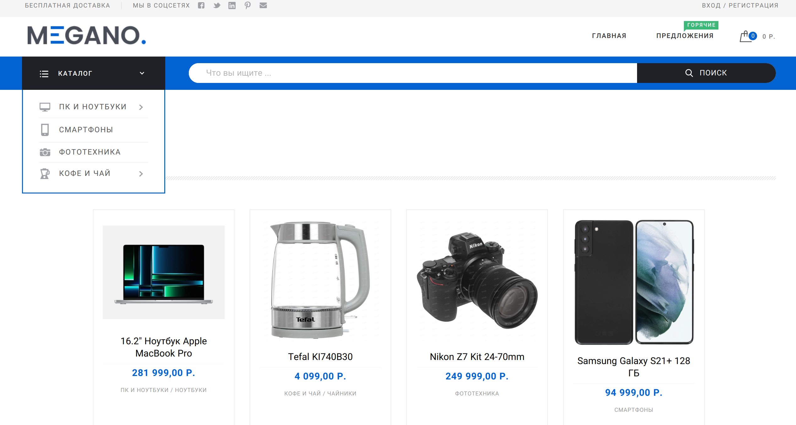

# Django-приложение, реализующее функции интернет-магазина

Интернет-магазин, реализующий функционал каталога с возможностью фильтрации товара, системы авторизации и 
ведения профилей пользователей, корзины покупок, механизма оформления заказа и сервиса оплаты.

### В проекте реализована следующая структура:
* Главная страница
* Регистрация/авторизация пользователей
* Каталог с фильтром и сортировкой
  * Непосредственно каталог товаров
  * Детальная страница товара, с отзывами
* Раздел оформления заказа
    * Корзина
    * Оформление заказа
    * Оплата
* Личный кабинет
    * Личный кабинет
    * Профиль
    * История заказов
* Кастомизированний административный раздел

### Особенности реализации:
+ Реализована авторизация по email, применены кастомные шаблоны регистрации, авторизации и восстановления доступа;
+ Корзина покупателя реализована как для зарегистрированного, так и не зарегистрированного пользователя (с последующим
переносом товаров после авторизации);
+ Фильтрация, сортировка и поиск товаров в каталоге реализована без применения сторонних библиотек;
+ Применены различные проверки и фильтры для сохранения целостности информации в БД;
+ В качестве сервиса mock-оплаты используется отдельное приложение на DRF. Сам механизм оплаты реализован через 
очередь задач Celery;
+ Для суперпользователя, в разделе "Личный кабинет" предусмотрен раздел для быстрой настройки наиболее используемых 
параметров приложения;
+ Применено кеширование данных о товаре;
+ Произведена кастомизация административного раздела, позволяющая легко и в одном месте управлять такими сущностями как
`пользователи`, `товары`, `категории` `товаров`, `заказы`;
+ Удаление пользователей, товаров, категорий товаров и заказов осуществляется через механизм "мягкого удаления".

Приложение доступно для тестового использования по [ссылке](https://german.anufrikov.com/).

### Комментарии по установке:
**Необходимо выполнить следующие действия:**
+ Склонировать репозиторий;
+ Создать базу данных Postgres с именем `marketplace` или другим, указав его в файле настроек;
+ Создать файлы `.env` и `.env.db` и указать в них настройки в соответствии с шаблонами;
+ В зависимости от окружения, где будет запущено приложение, проверить актуальность значений переменных;
`ALLOWED_HOSTS` и `CSRF_TRUSTED_ORIGINS` в файле настроек приложения `setting.py`;
+ Провести ревизию файла `docker-compose.yml` на предмет доступности указанных в нём открытых портов на хосте; 
+ В случае необходимости установки SSL сертификата, раскомментировать блок с `certbot` в файле `docker-compose.yml`;
+ Отредактировать файл `nginx.conf`;
+ Запустить контейнеры командой `docker-compose up -d --build`;
+ Применить миграции БД командой `docker exec django_ecomerce_web_1 python manage.py migrate`;
+ Собрать статические файлы приложения командой `docker exec django_ecomerce_web_1 python manage.py collectstatic`.

### Django e-commerce web application

This is Django e-commerce web application with catalog, filters, comments, user profile, cart and mock payment service.

### The project has the following structure:
* Main page
* User registration/authorization pages
* Product catalogue with sorting and filter features
  * Product catalogue
  * Product detail view page with comments
* Checkout section
    * Cart
    * Checkout
    * Payment
* User account 
    * User account 
    * User profile
    * Order history
* Customized admin panel

### Some features:
+ The application uses authorization via email; 
+ Custom registration, authorization and access recovery templates are applied;
+ The shopping cart is implemented for both registered and unregistered users (including migration items from the cart when 
unregistered user logging in);
+ Filtering, sorting and searching in the catalog is implemented without the use of third-party libraries;
+ Various checks and filters are applied to maintain the integrity of the information in the database;
+ A separate DRF application is used as a mock-payment service. The payment procedure is implemented through 
Celery task queue;
+ The superuser can manage the most used application settings via special page in "My Account" section; 
+ The product parameters are being cached;
+ The admin panel has been customized, allowing you to easily manage entities such as 
`users`, `goods`, `product categories`, `orders`;
+ Users, products, product categories and orders can be only "soft deleted".

You can test it [here](https://german.anufrikov.com/).

### Installation instructions:
**Please follow these steps::**
+ Clone this repository;
+ Create a Postgres database named `marketplace`. You can choose other name, but in this case you need to specify 
it in the settings file;
+ Create `.env` and `.env.db` files and specify the settings in them according to the templates;
+ Please check `ALLOWED_HOSTS` and `CSRF_TRUSTED_ORIGINS` variables in `setting.py` for relevance;
+ Review `docker-compose.yml` and check port forwarding; 
+ If you need to install an SSL certificate uncomment the `certbot` block in `docker-compose.yml`;
+ Check and edit `nginx.conf`;
+ Run docker-containers via `docker-compose up -d --build`;
+ Apply database migrations via `docker exec django_ecomerce_web_1 python manage.py migrate`;
+ Collect static files via `docker exec django_ecomerce_web_1 python manage.py collectstatic`.